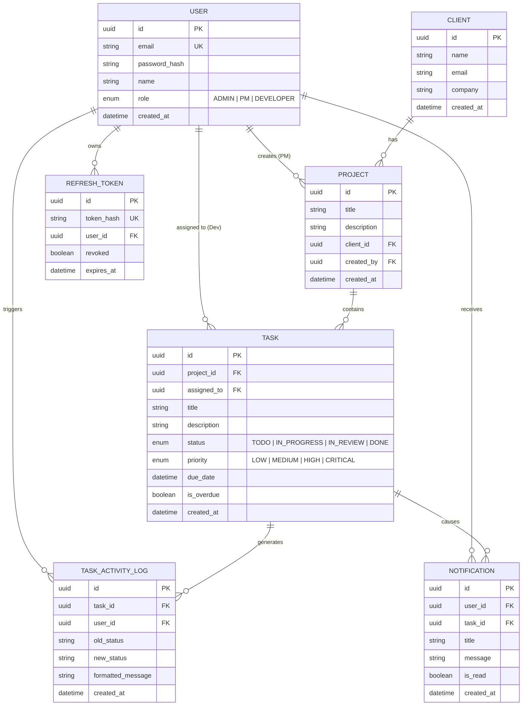

# SyncCoders | Real-Time Client Project Dashboard

A production-grade, full-stack client project dashboard built for agency operations. Features strict server-side role-based access control (RBAC), real-time activity feeds via Socket.io, automated overdue task detection via scheduled background jobs, dual-token JWT authentication with HttpOnly cookies, and database-backed audit logging.

---

## 🌟 Key Features

* **3-Tier Strict Role-Based Access Control (RBAC)**:
  * **Admin**: Full access across all agency clients, projects, tasks, and users; views global real-time activity.
  * **Project Manager (PM)**: Create and manage owned projects, assign tasks to developers, view activity strictly within their own projects.
  * **Developer**: Scoped strictly to assigned tasks; can update task status only; cannot see other developers' tasks or PM project management data.
* **Real-Time Activity Feed & Presence**:
  * Scoped WebSocket broadcast rooms preventing cross-tenant data leaks.
  * Formatted change history: *"Ravi Kumar moved Task 'Fix Container Route Bug' from IN_PROGRESS → IN_REVIEW"*.
  * 20-event offline catchup queried directly from PostgreSQL upon reconnection.
  * Live online presence tracking showing active connected users in the top navigation bar.
* **Automated Overdue Task Scheduler**:
  * Background cron job running every 60 seconds.
  * Automatically flags overdue tasks in PostgreSQL and dispatches real-time alerts to the assigned Developer and owning PM.
* **Dual-Token Authentication**:
  * 15-minute Access Token stored in application memory.
  * 7-day Refresh Token stored in a secure `HttpOnly`, `SameSite=Lax/Strict` cookie, tracked and revocable in PostgreSQL.
  * Axios response interceptor for silent token refresh on HTTP 401 without user disruption.
* **Shareable URL-Synced Filters**:
  * Task lists filterable by status, priority, and overdue state via URL search parameters (`?status=IN_PROGRESS&priority=HIGH`).
* **In-App Notification Center**:
  * Interactive bell with live unread badge count.
  * Individual mark-as-read and "Mark all read" capabilities.

---

## 🏗️ Architecture & Tech Stack

| Layer | Technology | Justification |
| :--- | :--- | :--- |
| **Frontend** | React 18, TypeScript, Vite, Tailwind CSS, Lucide Icons | Type safety, rapid UI iteration, accessible design with zero layout shift. |
| **Server State** | TanStack Query (React Query) | Automated cache invalidation on WebSocket events, optimistic UI state, and query deduplication. |
| **Backend** | Node.js, Express, TypeScript | Clean middleware pipeline for RBAC, predictable lifecycle, and first-class Socket.io ecosystem support. |
| **Database & ORM** | PostgreSQL 16, Prisma ORM | ACID transactions for audit logs, strict foreign key constraints, and end-to-end type safety. |
| **Real-Time** | Socket.io | Built-in room abstractions (`project:id`, `user:id`, `pm:id`, `admin-feed`), automatic reconnect with exponential backoff, and heartbeat presence. |
| **Scheduler** | node-cron | Lightweight, zero external infrastructure required for single-instance or containerized execution. |

---

## 🗄️ Database Schema & Relational Design



### Strategic Indexing Rationale

1. **`Task(assigned_to, status)`**:
   * *Rationale*: Developer dashboards filter strictly by `assigned_to = :userId` and status. A compound B-tree index eliminates sequential table scans and provides instant query lookups.
2. **`Task(due_date, is_overdue, status)`**:
   * *Rationale*: The background scheduler runs every 60 seconds querying `WHERE due_date < NOW() AND is_overdue = false AND status != 'DONE'`. Without this index, PostgreSQL would execute a full table scan on every cron tick.
3. **`TaskActivityLog(task_id, created_at DESC)` & `(created_at DESC)`**:
   * *Rationale*: Powers the 20-event offline catchup and role-scoped feeds, returning the latest events in sub-millisecond time.
4. **`Notification(user_id, is_read, created_at DESC)`**:
   * *Rationale*: Enables instantaneous unread count calculation and dropdown rendering for active users.

---

## 📐 Architectural Decisions & Justifications

### 1. WebSocket Library Choice: Socket.io vs. Native WebSocket
* **Decision**: We selected **Socket.io**.
* **Justification**: While native WebSockets (`ws`) offer a slightly smaller footprint, they lack built-in **room management**, **heartbeats**, and **connection state recovery**. In our application, security depends on targeted room scoping (`admin-feed`, `pm:<id>`, `user:<id>`, `project:<id>`). Socket.io provides authenticated connection handshakes, room joins, and seamless reconnection with exponential backoff out of the box, preventing hundreds of lines of error-prone boilerplate.

### 2. Background Scheduler: node-cron vs. BullMQ
* **Decision**: We selected **node-cron**.
* **Justification**: For a single-instance container or standard deployment, `node-cron` provides zero-dependency in-process scheduling with minimal RAM footprint. Introducing BullMQ requires provisioning an active Redis instance. If scaling horizontally across multiple server instances in the future, we would transition to BullMQ + Redis to enforce distributed distributed locks (preventing duplicate cron runs across nodes).

### 3. Token Storage & Security: HttpOnly Cookies vs. localStorage
* **Decision**: Dual-token architecture with **HttpOnly cookies**.
* **Justification**: Storing refresh tokens in `localStorage` exposes them to Cross-Site Scripting (XSS) attacks where any injected third-party script can steal credentials. By placing the 7-day refresh token in an `HttpOnly`, `SameSite=Lax/Strict`, `Secure` cookie, client-side JavaScript cannot access it. The short-lived (15 min) access token is kept in memory. When it expires, an Axios interceptor silently exchanges the HttpOnly cookie for a fresh access token without user friction.

---

## 🚀 Quickstart & Local Setup

### Option A: Using Docker Compose (Recommended)

1. Clone the repository and navigate to root:
   ```bash
   git clone <repository-url>
   cd SyncCoders
   ```
2. Start the full stack with Docker Compose:
   ```bash
   docker compose up --build -d
   ```
3. Run the database seed inside the server container:
   ```bash
   docker compose exec server npm run seed
   ```
4. Access the application:
   * **Frontend**: `http://localhost:3000`
   * **Backend API**: `http://localhost:5000`

---

### Option B: Local Non-Docker Development

#### 1. Backend Setup
```bash
cd server
cp .env.example .env
# Ensure DATABASE_URL in .env points to your local or cloud PostgreSQL instance (Neon / Supabase)

npm install
npx prisma generate
npx prisma db push
npm run seed
npm run dev
```

#### 2. Frontend Setup
```bash
cd ../client
npm install
npm run dev
```
Open `http://localhost:5173` in your browser.

---

## 👥 Seed Accounts & Demo Credentials

The database seed script generates realistic test data:
* **Admin**: `admin@agency.com` / `admin123`
* **Project Manager 1**: `pm1@agency.com` / `pm123`
* **Project Manager 2**: `pm2@agency.com` / `pm123`
* **Developer 1**: `dev1@agency.com` / `dev123`
* **Developer 2**: `dev2@agency.com` / `dev123`
* **Developer 3**: `dev3@agency.com` / `dev123`
* **Developer 4**: `dev4@agency.com` / `dev123`

*Includes 3 projects, 16 tasks across all statuses, 2 guaranteed overdue tasks, and historical activity logs.*

---

## 📝 Required Explanation Field (Submission Write-up)

> **The hardest problem solved**: Ensuring consistent, secure real-time state synchronization across strict role boundaries without leaking confidential agency data. Instead of broadcasting raw task payloads globally and letting the client filter them (a major security vulnerability), we engineered a scoped room architecture in Socket.io paired with database-driven transaction logs. 
> 
> **How real-time role-filtered feeds were handled**: We mapped each connected client to authenticated Socket.io rooms based on their verified JWT claims during handshake. When a task status transitions, the backend performs an atomic transaction—updating the task and recording a structured `TaskActivityLog` row. The event is targeted strictly to `admin-feed`, the project's owner (`pm:<pmId>`), the assigned developer (`user:<devId>`), and active viewers of the project (`project:<projectId>`). For offline users, we query the PostgreSQL `TaskActivityLog` indexed by role constraints and `created_at DESC`, guaranteeing an immediate catchup of the last 20 missed events upon reconnection.
> 
> **What I would do differently**: For multi-instance scaling in high-traffic environments, I would replace the in-process `node-cron` and in-memory Socket.io adapter with **BullMQ** and **Redis Pub/Sub** (via `@socket.io/redis-adapter`). This would prevent duplicate cron executions across worker nodes and enable seamless horizontal scaling of WebSocket connections.

---

## 🛡️ Role-Based Access Verification Checklist

- [x] Direct API tampering blocked: Developer token hitting `POST /api/projects` returns `403 Forbidden`.
- [x] Resource isolation: PM 2 hitting `/api/projects/:id` for PM 1's project returns `403 Forbidden`.
- [x] Status-only mutation: Developer attempting to update task title or assignee returns `403 Forbidden`.
- [x] No `localStorage` token storage: Refresh token lives strictly in `HttpOnly` cookie.
- [x] No polling: All feeds, presence counts, and unread notifications arrive via WebSocket.
- [x] Automated background overdue scheduler: Runs via `node-cron` every minute; never on page load.
